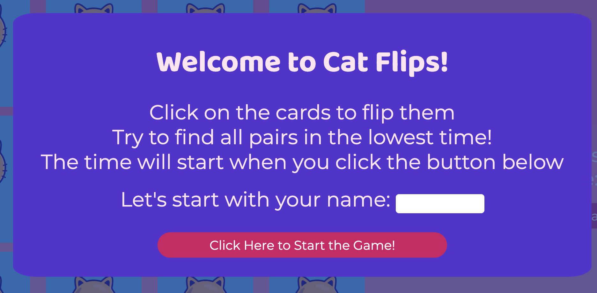

# Cat Flips Memory Game
Cat Flips is a fun memory game designed to be responsive on all devices allowing it to be played on all screen sizes.

Link for the finished deployed site: [Cat Flips](https://saziosu.github.io/cat-flips/)

# Table of Contents

* [User Experience](#user-experience)
    * [User Stories](#user-stories)
    * [Wireframes](#wireframes)
* [Design](#design)
    * [Color Scheme](#color-scheme)
    * [Tyopgraphy](#typography)
    * [Imagery](#imagery)
* [Features](#features)
    * [Current Features](#current-features)
    * [Future Features](#future-features)
    * [Accessibility](#accessibility)
* [Technology Used](#technology-used)
    * [Languages](#languages)
    * [Frameworks, Libraries & Programs](#frameworks-libraries--programs)
* [Deployment](#deployment)
* [Testing](#testing)
* [Credits](#credits)
    * [Code](#code)
    * [Media](#media)
    * [Acknowledgements](#acknowledgements)

# User Experience

The goal of the site is to be brightly colored and attractive to the user, while accessible and easy to use and understand.
 
The name entry at the start of the game offers a personalised experience for the user.
 
The moves and timer are easily viewed by the user during the game, so they can be aware of their stats at any moment.

## User Stories

* First Time User
  * As a first time User, we want to be aware of any rules or processes involved in the game, prior to starting the game.
  * As a first time User, we want the site to be attracitve and easy to use across many devices.
  * As a first time User, we want to be able to immediately play again without refreshing the page.
* Returning User
  * As a returning User, we want the cards to be shuffled every time we play so it is not predictable and repetitive.
  * As a returning User, we want the rules to be available to us again to ensure we know how to play again.

## Wireframes

Balsamiq was used to create the wireframes for this project for desktop, tablet and mobile screens

# Design

## Color Scheme

The color scheme for the website was inspired by this color palette sourced from Canva

The colors were edited to ensure accessibility, with the following being the final colors for the project

## Typography

Fonts were chosed from GoogleFonts

* Baloo 2 was used for headings

* Montserrat was used for all other text

* San-serif was used for the fallback font for all external fonts

## Imagery

* Images in the body were sourced from [FreePik](https://www.freepik.com/).
* Favicon images were generated via [favicon.io](https://favicon.io/favicon-generator/)

# Features 

### Start Modal

The modal at the start of the game welcomes the user to the game, and asks them to input their name. 
The button tells the user that the game will start when it is clicked, letting them know that the time begins when they click the button.

### Cards

The back face of the cards are immediately seen on starting the game. They are all clickable and are consistent with the color scheme.

### Game Stats

The game stats part of the page shows the user's name that they entered in the starting modal. It also tracks their time in seconds and the number of moves they have made.
The reset button allows the user to control the game and start afresh, by resetting the moves and time and shuffling the cards.

### End Modal

The end modal is consistent in style and color with the start modal. It congradulates the user on their win and provides them with their end moves and the number of seconds it took to complete the game.
The button entices the user to play the game again. This button resets the time and moves and also shuffles the cards.

## Current Features

## Future Features

## Accessibility

* Semantic HTML was used in the index.html file to ensure accessibility.
* All images were given alt tags to ensure they could be read by screenreaders.
*  XXXXXXXXXXX

# Technology Used

## Languages

* HTML
* CSS
* JavaScript

## Frameworks, Libraries & Programs 

* [Balsamiq](https://balsamiq.com/wireframes/) was used to create the wireframes to plan out the website.
* [GoogleFonts](https://fonts.google.com/) were used to import the font.
* [Adobe Express Editor](https://express.adobe.com/tools/image-resize) was used to resize the images.
* [Flexbox](https://developer.mozilla.org/en-US/docs/Web/CSS/CSS_Flexible_Box_Layout) was used to construct a flexible layout and responsive design
* [Git](https://git-scm.com/) was used for version control
* [Gitpod](https://gitpod.io/) was used to write the code
* [GitHub](https://github.com/) was used to deploy the site code
* [AmIResponsive](https://ui.dev/amiresponsive) was used to create the cross device responsivity images

# Deployment

GitHub pages was used to deploy this site:

1. Login (or signup) to Github.
2. Go to the repo for the project, [saziosu/cat-flips](https://github.com/saziosu/cat-flips/).
3. Click the settings button.
4. Select pages on the left navigation menu.
5. From the source dropdown select main branch and click save next to it.
6. The site has been deployed on clicking save, this can take a few moments to generate the live link at the top of the settings page.

# Testing

[TESTING.md](TESTING.md)

# Credits

## Code

* [freeCodeCamp.org](https://www.youtube.com/watch?v=ZniVgo8U7ek), I followed this tutorial to help create the structure for the flip card game and also to help me with turning the cards and blocking the board when the second card is turning.
* [PortEXE](https://youtu.be/3uuQ3g92oPQ). I used this tutorial to help me implement the Fisher-Yates Shuffle algorithm to shuffle my cards
* TIMER
* [Code Institute](https://github.com/saziosu/love-maths), I used the Love Maths project as inspriation for helping me count the number of moves.

## Media

* [Catalyst @ FreePik](https://www.freepik.com/author/catalyststuff) all images on the flip cards were sourced from this resource/artist.
* [Favicon.io](https://favicon.io/favicon-generator/) was used to generate the favicon

# Acknowledgements

* XXXXXX
* XXXXXX
* XXXXXX
* XXXXXX