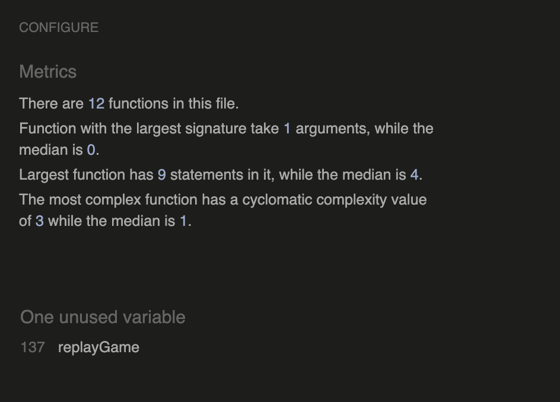
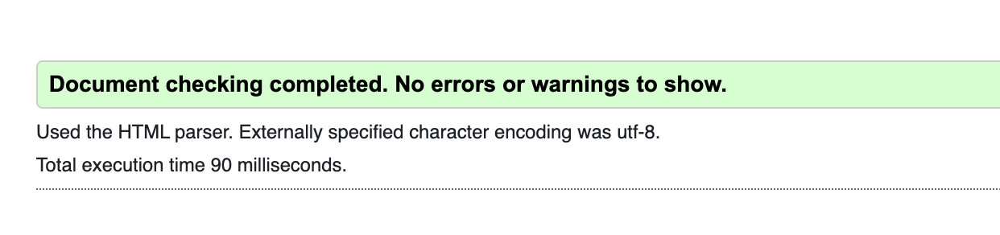
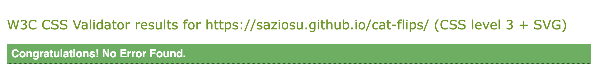
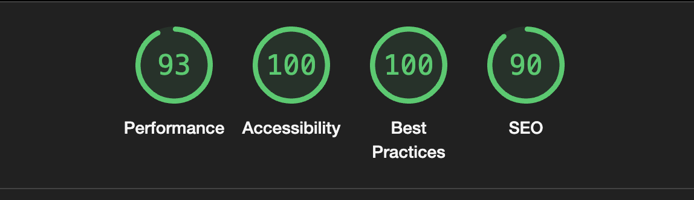

# Cat Flips | Testing

Link for the finished deployed site: [Cat Flips](https://saziosu.github.io/cat-flips/)


# Table of Contents

* [Automated Testing](#automated-testing)
    * [JavaScript Validator](#javascript-validator)
    * [HTML Validator](#html-validator)
    * [CSS Validator](#css-validator)
    * [Lighthouse](#lighthouse)
    * [Wave](#wave)
* [Manual Testing](#manual-testing)
    * [User Testing](#user-testing)
        * [First Time User](#first-time-user)
        * [Returning User](#returning-user)
        * [Frequent User](#frequent-user)
* [Full Testing](#full-testing)
* [Bugs](#bugs)
    * [Known Bugs](#known-bugs)
    * [Fixed Bugs](#fixed-bugs)

# Automated Testing

## JavaScript Validator

[Jshint](https://jshint.com/) was used to validate the JavaScript code in the project. 



The validator reports an unused variable for replayGame, this is a function that is called in the above code block in the button attribute:

```
   let successModal = `
    <div id="modal-content">
    <h1>Congratulations!<h1>
    <p>
    ${playerName}, you're a winner!
    <br>
    <br>
    You found all matches in ${timeScore} seconds
    <br>
    <br>
    You managed to find all matches in ${movesScore} moves
    <br>
    <br>
    Well done!
    </p>
    <button onclick="replayGame()" id="restart">Click Here to Play Again!</button>
    </div>
    `;
    modal.innerHTML = successModal;
}

// function to replay the game when the restart button is clicked
function replayGame() {
    timeInterval = setInterval(gameTimer, 1000);
    resetGame(); // shuffle deck and restart the moves and timer to zero
    modal.style.display = "none";
}
```


## HTML Validator
[W3C](https://validator.w3.org/) was used to validate the HTML code in the project, passed all checks.



## CSS Validator

[Jigsaw](https://jigsaw.w3.org/css-validator/) was used to validate the CSS code in the project, passed all checks.



## Lighthouse

Lighthouse, via chrome dev tools, was used to ensure the accessibility is at an acceptable level:



## WAVE

[WAVE](https://wave.webaim.org/) was used to check accessibility


# Manual Testing

## User Testing

### First Time User

|Goal|Achieved|
|-|-|
|As a first time User, we want to be aware of any rules or processes involved in the game, prior to starting the game.|A modal is seen on the initial page load which explains how to play and a button to indicate when it will start.|
|As a first time User, we want the site to be attractive and easy to use across many devices.|A consistent color scheme is used throughout the project with media queries used to ensure it is responsive on all screen sizes.|
|As a first time User, we want to be able to immediately play again without refreshing the page.|Upon finishing the game, a modal will appear with the finishing time and moves, along with a button to replay if desired.|

### Returning User

|Goal|Achieved|
|-|-|
|As a returning User, we want the cards to be shuffled every time we play so it is not predictable and repetitive.|The cards are shuffled on each page load, game restart and when the reset button is clicked|
|As a returning User, we want the rules to be available to us again to ensure we know how to play again.|The start game modal with the game instructions is seen every time the game is loaded.|

# Full Testing

A range of devices were used to test the site.

* OnePlus 7T Pro (Firefox, chrome, opera)
* MAC: MacBook Pro 14-inch 2021 (Mac OS Ventura 13.4) (Chrome, Safari, Firefox)
* LENOVO Tab P11 11.5" Tablet (Chrome, Firefox)

[Browserstack](https://www.browserstack.com/) was also used to test on the following devices:

* iPhone 14 (Chrome, Safari)
* iPhone 12 mini (Chrome, Safari)
* Samsung s23 (Chrome, Firefox)
* iPad 10th (Chrome, Safari)

|Feature|Expected|Tested|Result|Pass/Fail|
|-|-|-|-|-|
|Start Modal|The start modal name input should be required, it must be filled|Left the input blank, clicked start button|The game does not start and prompts to fill in the input field|Pass|
|Start Modal|The start button should start the timer when clicked|Filled in the name input and clicked the start button|The timer started when button was clicked|Pass|
|Cards|Cards should flip to the front face when clicked|Clicked cards|Cards turned to the front face|Pass|
|Cards|When two cards are clicked, if they match they should remain turned over. If they don't match they should flip to back to the back face.|Clicked cards|Matching cards remained turned, mismatched cards flipped back over to the back face.|Pass|
|Cards|When all matches are found the game should end | Found all card matches |Game ended, end modal popped up with correct scores | Pass
|Game Stats|The game stats section should display the User's name along with the number of moves and the length of time in seconds|Entered name on start modal, clicked cards.|The name is displayed, the moves are calculated and the time is counted|Pass|
|Reset button|The reset game button in the game stats area should reset the timer and moves and also shuffle the deck|Found some matches and clicked the reset game button|The moves and timer were set to 0, and on testing the cards again they were not in the same places|Pass|
|End Modal|The end modal should display the user's name and the moves and time it took to complete the game|Finished the game|The player's name, moves and time count are displayed|Pass|
|End Modal|The replay game button should reset the moves and timer to zero and shuffle the cards|Played through game and hit the reset game button|Moves and Timer went to zero, cards were shuffled||
|External link in Footer|External link should open in a new tab|Clicked GitHub icon|New tab opened with the GitHub repo|Pass|

# Bugs

## Known Bugs

At this time, I am not aware of any further known bugs. All solved bugs are listed below.

## Fixed bugs

| Bug Presented | Resolution |
|--|--|
| When clicking on the cards, the card needed to be clicked twice to show the front face of the card. The first click showed a blank space and the second click showed the front face. | I used chrome dev tools to see that the image had a higher z-index rather than the divs with the class of `card` . I changed the z-index of the card divs to bring them forward. |
|If same card was clicked twice it was taking it as a matching pair because its dataset matched with itself.| Added seperate datasets for the matching cards such as `data-cat="avocado-cat-1"` and `data-cat="avocado-cat-2"` and used slice to match the cards if the datasets matched except for the last two characters in the dataset.|
|If clicking through the cards quickly, if a 3rd card was clicked before the second clicked card finished turning, it would allow three cards to be turned at once, breaking function to turn back all cards if there's no match. |I added a return value to help lock the rest of the board until the checkPair function confirmed if the cards matched and turned them back over.|
| Clicking on a non-matching second card did not show the second card turning. It immediately showed the first card moving back over. | Added timeout to the cards being turned back to slow this down and allow the second card to be seen. |
| shuffleDeck function, cards were shuffled before they were flipped back over and it could be seen what cards were moved where. | I added a timeout to the shuffle to have it happen after the flip back. |
| When game was finished, the endGame modal was showing the scores from the previous game instead of using the new ones. | Resolved by storing the current score in a new variable within the function and utilising this in the modal. Also set a span for the username input on the game-stats div, to pull from this for the modal and the value was not able to be read. |
| Reset game button when clicked the timer went to 1 instead of zero. | Set the seconds to `-1` to look better for the user. |
|Timer was not stopped correctly when the game was finished|Used a different method and set the timer in its own function, rather than within the startGame function only.|
|If the same card is clicked twice, it was being counted as a move.|Added an if statement to only increment the moves if the card's dataset does not match exactly.|
