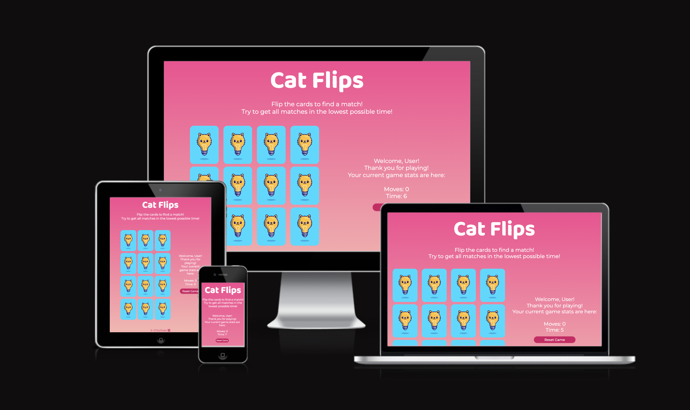

# Cat Flips | Testing

Link for the finished deployed site: [Cat Flips](https://saziosu.github.io/cat-flips/)

# Table of Contents

* [Automated Testing](#automated-testing)
    * [JavaScript](#javascript-validator)
    * [W3C](#html-validator)
    * [CSS Validator](#css-validator)
    * [Lighthouse](#lighthouse)
    * [Wave](#wave)
* [Manual Testing](#manual-testing)
    * [User Testing](#user-testing)
        * [First Time User](#first-time-user)
        * [Returning User](#returning-user)
        * [Frequent User](#frequent-user)
* [Full Testing](#full-testing)
* [Bugs](#bugs)
    * [Known Bugs](#known-bugs)
    * [Fixed Bugs](#fixed-bugs)

# Automated Testing

## JavaScript Validator

[Jshint](https://jshint.com/) was used to validate the JavaScript code in the project, did not report any significant problems.

## HTML Validator
[W3C](https://validator.w3.org/) was used to validate the HTML code in the project, passed all checks.

## CSS Validator

[Jigsaw](https://jigsaw.w3.org/css-validator/) was used to validate the CSS code in the project, passed all checks.

## Lighthouse

Lighthouse, via chrome dev tools, was used to ensure the accessibility is at an acceptable level:

## WAVE

[WAVE](https://wave.webaim.org/) was used to check accessibility

# Manual Testing

## User Testing

### First Time User

### Returning User

# Full Testing

A range of devices were used to test the site.

* OnePlus 7T Pro (Firefox, chrome, opera)
* MAC: MacBook Pro 14-inch 2021 (Mac OS Ventura 13.4) (Chrome, Safari, Firefox)
* LENOVO Tab P11 11.5" Tablet (Chrome, Firefox)

[Browserstack](https://www.browserstack.com/) was also used to test on the following devices:

* iPhone 14 (Chrome, Safari)
* iPhone 12 mini (Chrome, Safari)
* Samsung s23 (Chrome, Firefox)
* iPad 10th (Chrome, Safari)

# Bugs

## Known Bugs

At this time, I am not aware of any further known bugs. All solved bugs are listed below.

## Fixed bugs

| Bug Presented | Resolution |
|--|--|
| When clicking on the cards, the card needed to be clicked twice to show the front face of the card. The first click showed a blank space and the second click showed the front face. | I used chrome dev tools to see that the image had a higher z-index rather than the divs with the class of `card` . I changed the z-index of the card divs to bring them forward. |
|If clicking through the cards quickly, if a 3rd card was clicked before the second clicked card finished turning, it would allow three cards to be turned at once, breaking function to turn back all cards if there's no match. |I added a return value to help lock the rest of the board until the checkPair function confirmed if the cards matched and turned them back over.|
| Clicking on a non-matching second card did not show the second card turning. It immediately showed the first card moving back over. | Added timeout to the cards being turned back to slow this down and allow the second card to be seen. |
| shuffleDeck function, cards were shuffled before they were flipped back over and it could be seen what cards were moved where. | I added a timeout to the shuffle to have it happen after the flip back. |
| When game was finished, the endGame modal was showing the scores from the previous game instead of using the new ones. | Resolved by storing the current score in a new variable within the function and utilising this in the modal. Also set a span for the username input on the game-stats div, to pull from this for the modal and the value was not able to be read. |
| Reset game button when clicked the timer went to 1 instead of zero. | Set the seconds to `-1` to look better for the user. |
|Timer was not stopped correctly when the game was finished|Used a different method and set the timer in its own function, rather than within the startGame function only.|
|If the same card is clicked twice, it was being counted as a move.|Added an if statement to only increment the moves if the card's dataset does not match exactly.|
