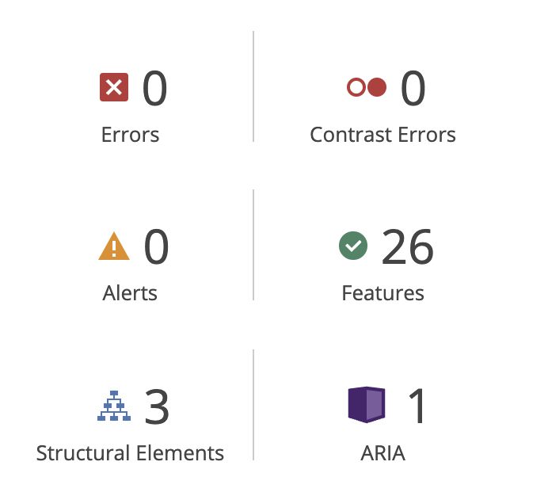

# Cat Flips | Testing

Link for the finished deployed site: [Cat Flips](https://saziosu.github.io/cat-flips/)

# Table of Contents

* [Automated Testing](#automated-testing)
    * [JavaScript](#javascript-validator)
    * [W3C](#html-validator)
    * [CSS Validator](#css-validator)
    * [Lighthouse](#lighthouse)
    * [Wave](#wave)
* [Manual Testing](#manual-testing)
    * [User Testing](#user-testing)
        * [First Time User](#first-time-user)
        * [Returning User](#returning-user)
        * [Frequent User](#frequent-user)
* [Full Testing](#full-testing)
* [Bugs](#bugs)
    * [Known Bugs](#known-bugs)
    * [Fixed Bugs](#fixed-bugs)

# Automated Testing

## JavaScript Validator

[Jshint](https://jshint.com/) was used to validate the JavaScript code in the project, did not report any significant problems.

## HTML Validator
[W3C](https://validator.w3.org/) was used to validate the HTML code in the project, passed all checks.

## CSS Validator

[Jigsaw](https://jigsaw.w3.org/css-validator/) was used to validate the CSS code in the project, passed all checks.

## Lighthouse

Lighthouse, via chrome dev tools, was used to ensure the accessibility is at an acceptable level:

## WAVE

[WAVE](https://wave.webaim.org/) was used to check accessibility

# Manual Testing

## User Testing

### First Time User

### Returning User

# Full Testing

A range of devices were used to test the site.

* OnePlus 7T Pro (Firefox, chrome, opera)
* MAC: MacBook Pro 14-inch 2021 (Mac OS Ventura 13.4) (Chrome, Safari, Firefox)
* LENOVO Tab P11 11.5" Tablet (Chrome, Firefox)

[Browserstack](https://www.browserstack.com/) was also used to test on the following devices:

* iPhone 14 (Chrome, Safari)
* iPhone 12 mini (Chrome, Safari)
* Samsung s23 (Chrome, Firefox)
* iPad 10th (Chrome, Safari)

# Bugs

## Known Bugs

## Fixed bugs

